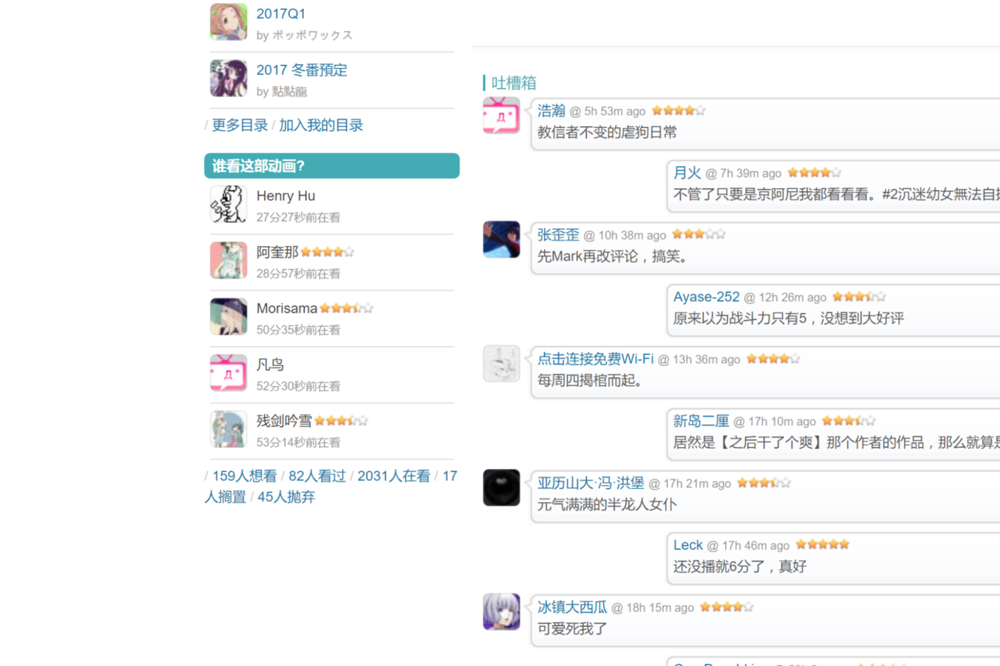

# [fifth](https://bgm.tv/user/fifth)

## [subjectPowerUp](subjectPowerUp.user.js?raw=true)

条目页面左下角状态信息优化，允许用户切换所有用户的状态信息/仅好友的状态信息（包括好友的头像，名字，观看时间，打分，评论，如果有的话）。

提供配置中心，可设置的内容包括：在〇好友数上限、〇过好友数上限、只显示打分的好友、只显示写评论的好友、默认折叠在〇/〇过好友列表。其中，当抓取的好友数量未达到设置的上限值时，以实际抓取到的好友数量为准，**请设置合理的上限数量，过大的上限值会减慢加载速度**，如果想看更多好友状态记录，请点击下方链接进入相关界面

之前提供的条目放送状态判断以智能显示在〇/〇过好友的功能现已弃用，改为同时显示在〇和〇过好友。

下面的截图为最早的版本，懒得换了。。。

[没有装的样子]

[装上后的样子]

[点击后的样子]

## [friendsPowerUp](friendsPowerUp.user.js?raw=true)

鼠标移到用户头像上是浮出小窗展示好友信息。

[装上后的样子]

