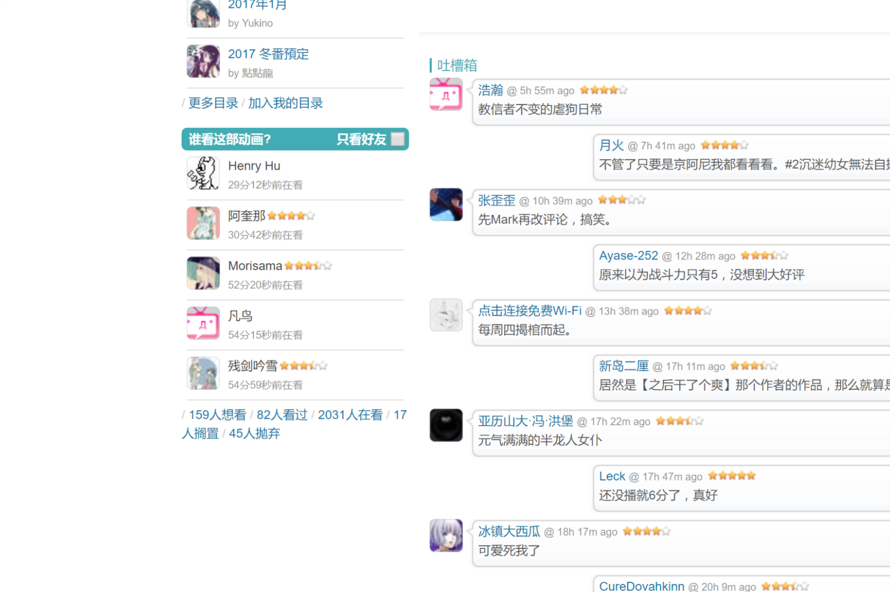

# [fifth](https://bgm.tv/user/fifth)

## [subjectPowerUp](subjectPowerUp.user.js?raw=true)

条目页面左下角状态信息优化，允许用户切换所有用户的状态信息/仅好友的状态信息（包括好友的头像，名字，观看时间，打分，评论，如果有的话）。

提供配置中心，可设置的内容包括：在〇好友数上限、〇过好友数上限、只显示打分的好友、只显示写评论的好友、默认折叠在〇/〇过好友列表。其中，当抓取的好友数量未达到设置的上限值时，以实际抓取到的好友数量为准，**请设置合理的上限数量，过大的上限值会减慢加载速度**，如果想看更多好友状态记录，请点击下方链接进入相关界面

之前提供的条目放送状态判断以智能显示在〇/〇过好友的功能现已弃用，改为同时显示在〇和〇过好友。

下面的截图为最早的版本，懒得换了。。。

[没有装的样子]

[装上后的样子]

[点击后的样子]

## [friendsPowerUp](friendsPowerUp.user.js?raw=true)

鼠标移到用户头像上是浮出小窗展示好友信息，这个脚本在bgm.tv所有页面（暂不支持超展开页面）里面都会生效。

如果正在是用@everpcpc 的[条目脚本](https://github.com/bangumi/scripts/tree/master/everpcpc)，同时打开两个脚本信息窗口会产生遮挡，建议只用一个

[!!!]如何看某用户的非动画条目评分及分布?

考虑到一部分用户的特殊需求，我做了相应的适配。但我个人主观上并不想让这个脚本的定制化程度太高，我留了一个配置在代码里面，如果有这方面需求的同学可以打开脚本代码，然后大概在第40行左右有一块被框起来的注释说明，按照注释里面说的操作就好了。
修改完保存之后请务必清空相应的localstorage（删除key值为fifth_bgm_user_userjs_scores的记录即可），不然有一定可能数据显示会不正确

**同时只能触发一种类型条目的追踪**

下面的截图为最早的版本，懒得换了。。。

[装上后的样子]

