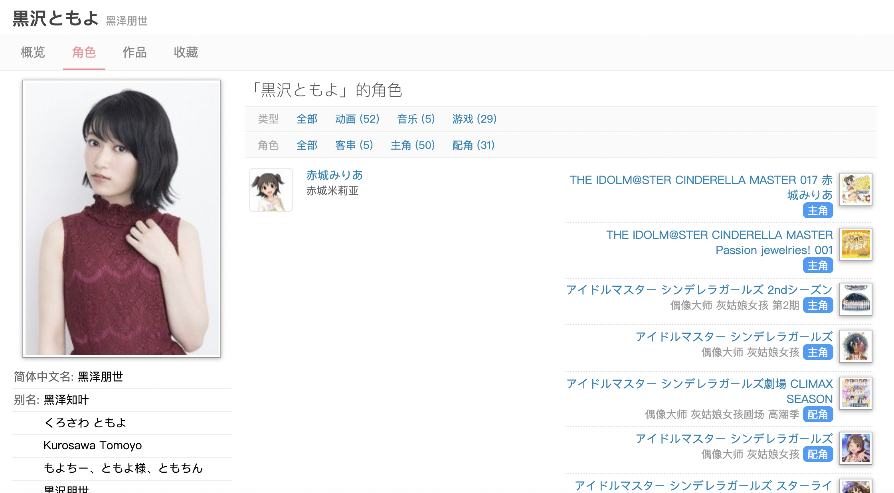
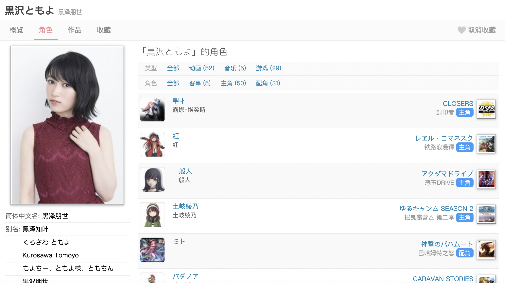

# [infinityloop](http://bangumi.tv/user/infinityloop)

## [声优出演角色按 ID 降序显示](https://github.com/bangumi/scripts/blob/master/infinityloop/sort_character_by_id.user.js)

  

对声优出演的角色按 ID 降序重新排列显示（[示例](https://bangumi.tv/person/9560/works/voice)）。其目的在于解决不能快速获悉最近演出角色的问题，但由于 Bangumi 本身不存在角色的出演日期这一字段，因此按照角色追加到 Bangumi 中的顺序（也就是 ID 顺序）作为排列，作为折中方案。

|  使用前（按人物名）   | 使用后（按 ID）  |
|  ----  | ----  |
|   |  |

如有使用问题请[新建议题进行报告](https://github.com/bangumi/scripts/issues/new?title=[%E5%A3%B0%E4%BC%98%E4%BD%9C%E5%93%81ID%E9%99%8D%E5%BA%8F]&body=@swsoyee%3Ch2%3E%E9%97%AE%E9%A2%98%E6%8A%A5%E5%91%8A%3C/h2%3E)。

## [🌙Bangumi.tv夜间模式](https://github.com/bangumi/scripts/raw/master/infinityloop/bangumi-night-mode.user.js)

[][Install with TamperMonkey]
[][Install with Stylish]

  

 
开启夜间模式配色。  

⭐全站启用护眼黑色调显示  
⭐点格子界面预览图圆形显示  
⭐支持帖子的隐藏文字`musk`鼠标划过显示  
⭐不对任何元素除了颜色以外的改变和调整  

[Install with TamperMonkey]: https://github.com/bangumi/scripts/raw/master/infinityloop/bangumi-night-mode.user.js
[Install with Stylish]: https://userstyles.org/styles/139310/bangumi-tv
