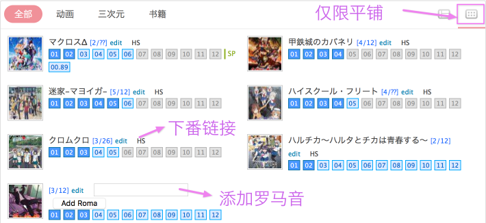
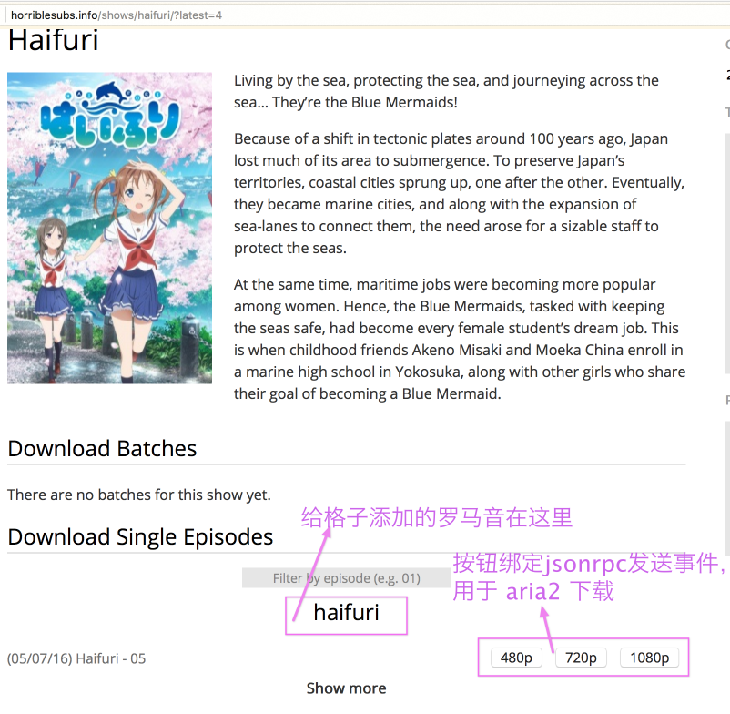

# [sinker](https://bgm.tv/user/sinker)

## [为首页格子添加下番链接](horriblesubs_magnet_to_aria2.user.js?raw=true)
作用: 为 bangumi 首页格子（仅限平铺模式）添加对应番组的下载链接
(指向 [Horrible Subs](http://horriblesubs.info/) 对应番组的资源列表)。

说明: 目前仅支持指向 Horrible Subs 这个英文字幕组的链接，跳转时会在链接后附上‘latest=x(看到第几集)’
，作为接下来的脚本过滤已看过番组的参数。

使用方式见下图

## [过滤 Horrible Subs 中已看番组 + 发送磁链到 aria2 的按钮](horriblesubs_magnet_to_aria2.user.js?raw=true)
作用: 如题

说明: 将脚本中的 'aria2Url' 和 'token' 变量设置为 aria2 的对应路径和 token 即可

使用方式见下图

