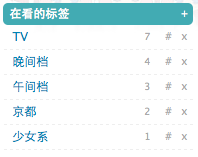
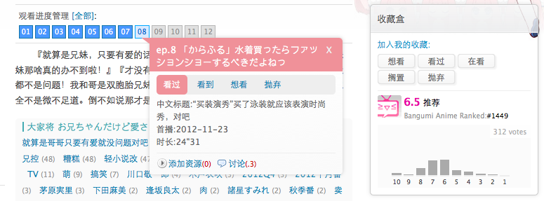

# [upsuper](http://bangumi.tv/user/upsuper)

## [首页条目名中文化](name_chinesizer.user.js?raw=true)

讨论帖：http://bangumi.tv/group/topic/20071

自动将 Bangumi 首页上的条目日文名翻译为中文名。包括顶部进度管理中的条目、热门条目讨论中的条目名，以及时间线上的所有条目。

每个条目第一次出现时程序会自动抓取条目页面并读取中文名，而后将缓存此中文名。如果条目原没有中文名而后添加了，或中文名修改了，访问该条目的条目页面将更新缓存的中文名。

首页右下角的 dock 里的菱形图标可以切换显示以中文为主或以日文为主。

## [目录管理增强](index_manager.user.js?raw=true)

讨论帖：http://bangumi.tv/group/topic/22038

增强目录管理功能。目前的功能为批量填写编号修改排序。未来计划添加拖拽排序支持、导入导出目录几批量删除的功能。

## [标签批量管理](tag_batch_editor.user.js?raw=true)

支持批量添加、修改、删除标签。虽然脚本支持多任务同时进行，但如果多个任务之间有交叉的条目，可能存在修改不完全的风险。

## [讨论增强](topic_enhancement.user.js?raw=true)

讨论增强目前包含了两个功能：

1. 标出上次浏览一个帖子之后发表的新回复；
2. 帖子内指向其他帖子的链接，鼠标悬浮时显示对应帖子的标题。

## [任意状态启用进度管理](ep_status_enabler.user.js?raw=true)

在 Bangumi 上，动画需要被标记为“在看”状态才能修改其进度。这个脚本使得动画无论处于什么收藏状态，都能够修改播放进度。未收藏时虽然也可以管理，但进度不会被显示出来。

## [Bilibili 放送标志](bilibili_onair.user.js?raw=true)

这个脚本会将首页上进度管理器中的绿标用于指示 Bilibili 上的新番更新情况。当B站将一个新番标记为今天内更新时，动画会出现绿标，同时对应的话数会被标绿，此外动画预览右上角的“放送中”标志变为一个链接，链接到B站上的最新话。

## [小组坟贴标记](mark_old_topic.user.js?raw=true)

此脚本会在帖子及每个回帖旁边显示一条粉红色的竖线，竖线的颜色越深表示帖子的发表时间距离现在越久远。通过观察竖线的深浅以及其在帖中的变化，就可以较容易地知道这一贴是否为坟贴，以及如果是坟贴，是在那层楼上被挖出来的。效果如下图所示：

## [侧栏 Dollars](sidebar_dollars.user.js?raw=true)
