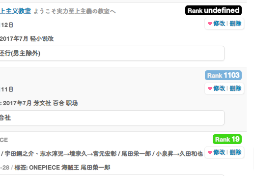

# [yonjar](https://bgm.tv/user/yonjar)

## [bangumi评论统计](https://github.com/bangumi/scripts/blob/master/yonjar/comments_detail.user.js?raw=true)

在标题右边显示该主题下的评论情况 

- 有多少用户发表过评论 
- 自己是否评论过 
- 鼠标移到用户名上查看评论次数

## [bangumi收藏列表显示Rank](https://github.com/bangumi/scripts/blob/master/yonjar/show_rank.user.js?raw=true)

在用户的收藏列表下显示作品的排名并高亮显示		
**不适配https 请求容易503 待修复**

- Rank1000以内背景为绿色 
- Rank1000~2000为蓝色 
- Rank2000外为红色 
- 没上榜的显示为"undefined" 背景为黑色

