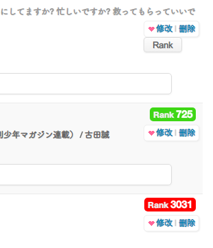
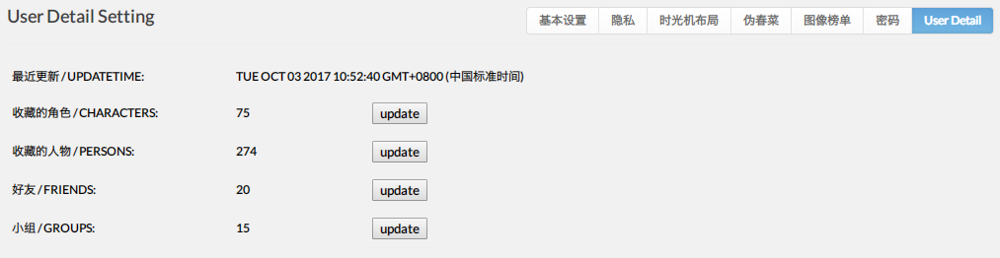

# [yonjar](https://bgm.tv/user/yonjar)

## [bangumi 上传图片](https://github.com/bangumi/scripts/blob/master/yonjar/image_uploader.user.js?raw=true)

在各种地方的回复框下加个"上传图片"

## [bangumi 浏览足迹](https://github.com/bangumi/scripts/blob/master/yonjar/topic_history.user.js?raw=true)

记录 bangumi 的话题浏览历史

## [bangumi 评论统计](https://github.com/bangumi/scripts/blob/master/yonjar/comments_detail.user.js?raw=true)

在标题右边显示该主题下的评论情况

- 有多少用户发表过评论
- 自己是否评论过
- 鼠标移到用户名上查看评论次数

## [bangumi 收藏列表显示 Rank](https://github.com/bangumi/scripts/blob/master/yonjar/show_rank.user.js?raw=true)

在用户的收藏列表下显示作品的排名并高亮显示

- 通过点击 "Rank" 按钮显示 Rank
- Rank1000 以内背景为绿色
- Rank1000~2000 为蓝色
- Rank2000 外为红色
- 没上榜的显示为 "undefined" 背景为黑色

## [好友动态&全站动态切换](https://github.com/bangumi/scripts/blob/master/yonjar/timeline_switch.user.js?raw=true)

好友动态&全站动态 切换
!全站动态只有一页

## [用户详情爬取](https://github.com/bangumi/scripts/blob/master/yonjar/user_detail.user.js?raw=true)

**2023 年 1 月 8 日复活!**

本脚本不提供实际的功能 但能方便其他用户自行编写脚本
爬取用户的资料 导出到 localstorage

- 收藏的角色
- 收藏的人物
- 好友
- 小组

初次使用要先到设置页`bangumi.tv/settings`进行首次爬取 以后**手动按需更新**

如何取出数据:

    let localData = localStorage.getItem('bgm_user_detail_by_yonjar');
    let user_detail = JSON.parse(localData);

数据结构:

    {
    	uid: "yonjar",    // 用户id
    	characters: ["23","456"],    // 收藏的角色 数组元素为id 下同
    	persons: ["67","1"],    // 收藏的人物
    	friends: ["sai","abc"],    // 好友
    	groups: ["a","u_devs"],    // 小组
    	updateTime: 1506999160287    // 当前数据最后更新时间
    }

## [bgm 角色数目统计](https://github.com/bangumi/scripts/blob/master/yonjar/character_plus.user.js?raw=true)

只是上面"用户详情爬取"脚本的一个 demo
某声优的出演角色页面功能增强

## [bgm 话题收藏](https://github.com/bangumi/scripts/blob/master/yonjar/topic_collect.user.js?raw=true)

收藏 bangumi 小组的话题、用户的日志、条目的讨论

## [整合 bangumi 小组(谷歌自定义)搜索](https://github.com/bangumi/scripts/blob/master/yonjar/google_search.user.js?raw=true)

整合 bangumi 小组(谷歌自定义)搜索

## [bangumi 条目图表增强](https://github.com/bangumi/scripts/blob/master/yonjar/subject_charts.user.js?raw=true)

动画条目下的 ep、vote、tags 和观看情况数据的简单可视化

## [bangumi 评论显示是否为好友](https://github.com/bangumi/scripts/blob/master/yonjar/who_is_my_friend.user.js?raw=true)

在主题下的评论高亮自己的好友的用户名, 本脚本功能依赖[user_detail.user.js](https://github.com/bangumi/scripts/blob/master/yonjar/user_detail.user.js?raw=true), 请先安装设置

## [bangumi 危险名单](https://github.com/bangumi/scripts/blob/master/yonjar/dangerous_list.user.js?raw=true)

标记用户 带简易屏蔽功能[讨论帖](https://bgm.tv/group/topic/358209)

## [wiki helper](https://github.com/bangumi/scripts/blob/master/yonjar/wiki_helper.user.js?raw=true)

个人自用 wiki 助手
具有假名转罗马字和简介框内文本预处理等功能
[讨论帖](https://bgm.tv/blog/296048)

## [bangumi 寿星名单](https://github.com/bangumi/scripts/blob/master/yonjar/happy_birthday_everyday.user.js?raw=true)

!!!未完善 想试用需要自行构造 json 数据!!!
示例代码("9"是月份, "4"和"30"是日数):

    json = {
      "9": {
        "4": [
          {
            "name": "長濱ねる",
            "birthday": "1998年9月4日",
            "bio": "長濱 ねる（ながはま ねる、1998年9月4日 - ）は、欅坂46およびけやき坂46の元メンバー。長崎県長崎市出身。Seed & Flower合同会社所属。",
            "year": 1998
          }
        ],
        "30": [
          {
            "name": "今泉佑唯",
            "birthday": "1998年9月30日",
            "bio": "今泉 佑唯（いまいずみ ゆい、1998年9月30日 - ）は、欅坂46の元メンバー。1623マネジメント所属。神奈川県出身。",
            "year": 1998
          }
        ],
      }
    }

    localStorage.setItem("yonjar_birthdaySet", JSON.stringify(json))

把角色或人物的生日添加到 localstorge 并在生日当天显示
[讨论帖](https://bgm.tv/group/topic/424350)
